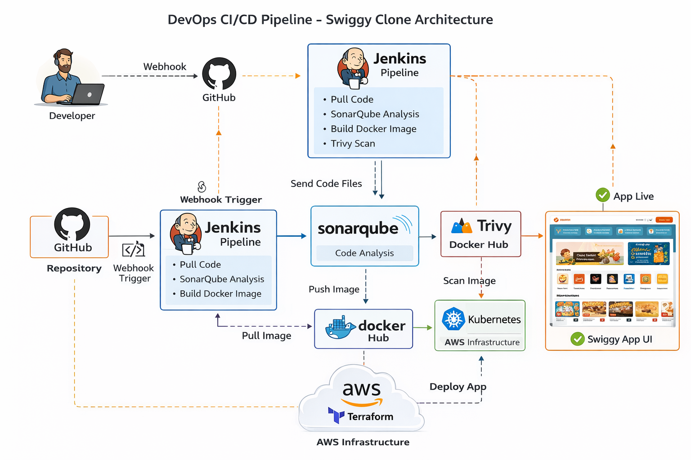

# 🚀 Swiggy Clone DevOps Project

This project demonstrates a complete **DevOps CI/CD pipeline** for deploying a Swiggy-like web application using modern tools and best practices.

---

# 📌 Tech Stack

* Frontend: React.js
* CI/CD: Jenkins (Docker)
* Code Quality: SonarQube
* Containerization: Docker
* Security Scan: Trivy
* Orchestration: Kubernetes
* Infrastructure: Terraform (AWS)

---

# 🏗️ Architecture Diagram



```
Developer → GitHub → Jenkins → SonarQube → Docker Build → Trivy Scan → Docker Hub → Kubernetes Deploy
```

### 🔄 Flow Diagram

```
[ Developer ]
      ↓
[ GitHub Repository ]
      ↓ (Webhook Trigger)
[ Jenkins Pipeline ]
      ↓
[ SonarQube Analysis ]
      ↓
[ Docker Build Image ]
      ↓
[ Trivy Security Scan ]
      ↓
[ Push to Docker Hub ]
      ↓
[ Kubernetes Deployment ]
      ↓
[ Application Live ]
```

---

# ⚙️ CI/CD Pipeline Flow Explained

1. Developer pushes code to GitHub
2. Jenkins pipeline is triggered automatically
3. Jenkins pulls latest code
4. SonarQube performs code quality analysis
5. Docker image is built
6. Trivy scans image for vulnerabilities
7. Image is pushed to Docker Hub
8. Kubernetes deploys the application

---

# 📸 Screenshots

## 🔹 Jenkins Pipeline


## 🔹 Application UI


---

# 🛠️ Setup Instructions

## 1️⃣ Clone Repository

```
git clone https://github.com/your-username/swiggy-clone-project.git
cd swiggy-clone-project
```

---

## 2️⃣ Run Jenkins & SonarQube (Docker)

```
docker run -d -p 8080:8080 jenkins/jenkins:lts
docker run -d -p 9000:9000 sonarqube:lts-community
```

---

## 3️⃣ Build Docker Image

```
docker build -t swiggy-clone .
```

---

## 4️⃣ Run Kubernetes Deployment

```
kubectl apply -f Kubernetes/deployment.yml
kubectl apply -f Kubernetes/service.yml
```

---

# 🔐 Security

* Trivy is used for vulnerability scanning
* Sensitive files are ignored using `.gitignore`

---

# 📈 Future Improvements

* Add Helm Charts
* Implement GitHub Actions alternative
* Add monitoring (Prometheus + Grafana)

---

# 👨‍💻 Author

DevOps Project by Soumya Ranjan Nayak

---
